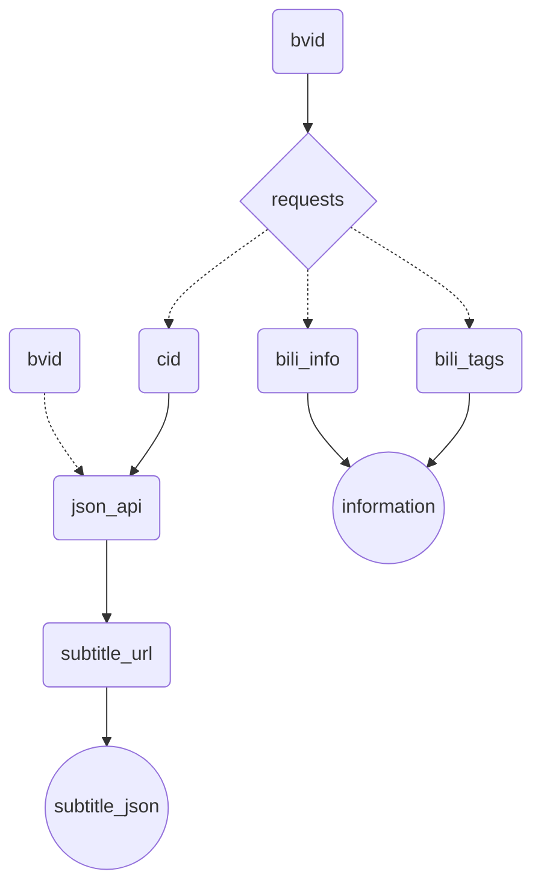

# 通过API获取字幕

## 概述

使用的API有：

- `https://api.bilibili.com/x/web-interface/view`，带参数`bvid`
- 'https://api.bilibili.com/x/player/pagelist?bvid='+bvid，用于请求`cid`
- f'https://api.bilibili.com/x/player/v2?bvid={bvid}&cid={cid}'，用于请求`subtitle_url`
- 返回的`subtitle_url`，用于获取字幕

## workflow

