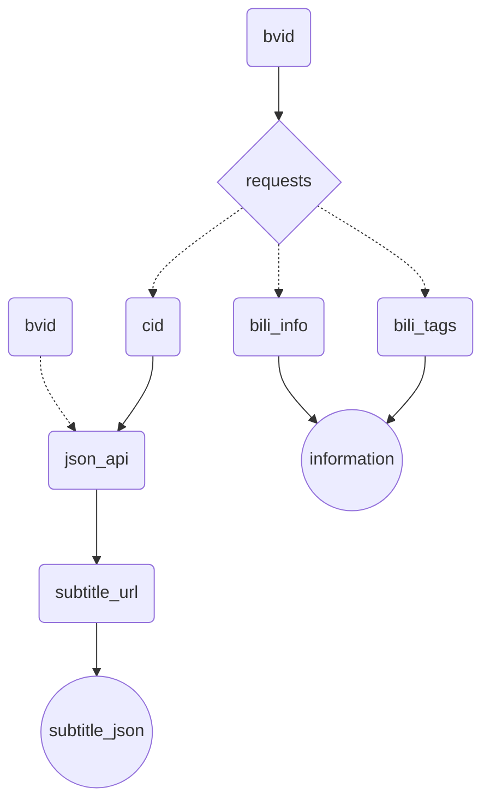

 

# 通过API获取字幕

## 概述

使用的API有：

- ‘https://api.bilibili.com/x/web-interface/view’ ，带参数`bvid`
- 'https://api.bilibili.com/x/player/pagelist?bvid=' +bvid，用于请求`cid`
- f'https://api.bilibili.com/x/player/v2?bvid={bvid}&cid={cid}' ，用于请求`subtitle_url`
- 返回的`subtitle_url`，用于获取字幕

详细抓取过程请见jupyter notebook
## workflow

b站API的请求原理图：



## 需要做的准备

### 关联数据库

在`Notion`中创建数据库，保存密钥


本地创建database

格式如下：

| NAME     | TYPE            |
| -------- | --------------- |
| title    | `title`         |
| cover    | `files & media` |
| URL      | `URL`           |
| UP主     | `text`          |
| 分区     | `select`        |
| tags     | `multi select`  |
| 发布时间 | `date`          |
| 加入时间 | `date`          |

得到`notion_token`和`database_id`

### 上传至图床

本项目从bilibili获取的`cover`将会上传至阿里云oss图床中

markdown文本和上传至notion中的图片链接均为阿里云图床的链接

得到`access_key_id`，`access-key-secret`，`bucket_name`和`endpoint`

### 添加密钥

在`workflow`目录下添加`settings.json`文件，内容如下：

```json
{
    "notion_token": "",
    "database_id": "",
    "api_key": "",
    "access_key_id": "",
    "access_key_secret": "",
    "bucket_name": "",
    "endpoint": ""
}
```

将之前得到的信息填入对应的键值对中即OK

`api_key`为chatGPT的API密钥，目前功能还不完整因此不要填

### shell

为程序添加了命令行访问的方法，实现了在任何目录下使用该命令

shell脚本的文件名：`bilidl`，可以没有`.sh`后缀

```shell
#!/bin/bash

if [ "$#" -eq 1 ]; then
    python /path/to/main.py "$1"
elif [ "$#" -eq 2 ] && [ "$2" = "p_num" ]; then
    python /path/to/main.py "$1" p_num
else
    echo "Usage: bilidl.sh bvid [p_num]"
    exit 1
fi
```

你需要将`main.py`文件的绝对地址 `/path/to/main.py`改为在你的计算机中的绝对地址

给予执行权限：

```shel
chmod +x bilidl
```

移动到系统的PATH（添加到环境变量）中：

```shell
sudo mv bilidl /usr/local/bin
```

在执行时使用如下命令：

```shell
bilidl <bvid> (p_num)
```

`p_num`是可有可无的，无参数时默认为`0`

## References

- https://developers.notion.com/reference/intro

- https://github.com/DavinciEvans/chatGPT-Summary-Bilibili-To-Notion

- https://zhuanlan.zhihu.com/p/610250035
